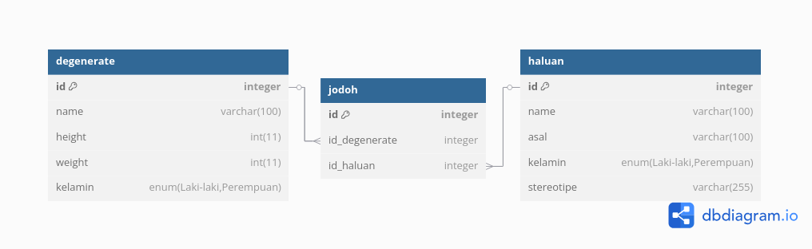

# TP10DPBO2025C2
Saya Zaki Adam dengan NIM 2304934 mengerjakan Tugas Praktikum 10 dalam mata kuliah Desain dan Pemrograman Berorientasi Objek untuk keberkahan-Nya maka saya tidak akan melakukan kecurangan seperti yang telah dispesifikasikan. Aamiin.

# Degenerate Database Management
## Desain Database

### 1. **degenerate**

- Table ini sepertinya menyimpan informasi mengenai satu kelompok individu.
- **Columns**:
    1. `id` (integer, Primary Key): Pengidentifikasi unik untuk setiap catatan dalam table ini.
    2. `name` (varchar(100)): Nama individu.
    3. `height` (int(11)): Tinggi badan individu, kemungkinan dalam sentimeter.
    4. `weight` (int(11)): Berat badan individu, kemungkinan dalam kilogram.
    5. `kelamin` (enum('Laki-Laki', 'Perempuan')): Jenis kelamin individu, terbatas pada 'Laki-Laki' atau 'Perempuan'.

### 2. **haluan**

- Table ini tampaknya menyimpan informasi mengenai kelompok individu lainnya.
- **Columns**:
    1. `id` (integer, Primary Key): Pengidentifikasi unik untuk setiap catatan dalam table ini.
    2. `name` (varchar(100)): Nama individu.
    3. `asal` (varchar(100)): Ini bisa mewakili asal atau kota asal individu.
    4. `kelamin` (enum('Laki-Laki', 'Perempuan')): Jenis kelamin individu, terbatas pada 'Laki-Laki' atau 'Perempuan'.
    5. `stereotipe` (varchar(255)): Ini kemungkinan menyimpan stereotip deskriptif atau karakteristik yang terkait dengan individu tersebut.

### 3. **jodoh**

- Table ini bertindak sebagai table penghubung atau asosiatif (junction table), yang menghubungkan catatan dari table `degenerate` dengan catatan dari table `haluan`.
- **Columns**:
    1. `id` (integer, Primary Key): Pengidentifikasi unik untuk setiap instance hubungan dalam table ini.
    2. `id_degenerate` (integer, Foreign Key): Merujuk ke `id` column di table `degenerate`.
    3. `id_haluan` (integer, Foreign Key): Merujuk ke `id` column di table `haluan`.

### **Relationships**

- Table `jodoh` membentuk sebuah many-to-many relationship antara table `degenerate` dan table `haluan`.
    - `jodoh.id_degenerate` references `degenerate.id`.
    - `jodoh.id_haluan` references `haluan.id`.
    - Ini berarti satu catatan di `degenerate` dapat dihubungkan dengan banyak catatan di `haluan` melalui table `jodoh`, dan sebaliknya.
## 🧩 Desain Program

### 📁 Model
Komponen yang menangani logika data dan interaksi langsung dengan basis data.
- `Database.php`  
    Menyediakan koneksi ke database serta fungsi-fungsi eksekusi query MySQL.
- `Degenerate.php`, `Haluan.php`, `Jodoh.php`  
    Representasi entitas domain yang mencerminkan masing-masing tabel di database.
    
### 📁 ViewModel
Berfungsi sebagai penghubung antara View dan Model, mengenkapsulasi logika presentasi dan memproses data dari Model sebelum ditampilkan di View.
- `DegenerateViewModel.php`  
    Mengelola data dan operasi yang berkaitan dengan entitas _Degenerate_.
- `HaluanViewModel.php`  
    Mengelola transformasi data dan tindakan dari View untuk entitas _Haluan_.
- `JodohViewModel.php`  
    Menyediakan binding data dan command logic untuk entitas _Jodoh_.

### 📁 View
Komponen antarmuka pengguna yang bertanggung jawab dalam rendering tampilan dan menerima input pengguna.
- Template HTML digunakan sebagai basis tampilan (misalnya `list.html`, `form.html`).
- Berkomunikasi dengan ViewModel untuk mendapatkan dan memperbarui data.

### 📄 `index.php`
Merupakan _entry point_ aplikasi. Bertugas merouting permintaan pengguna dan memuat View serta ViewModel yang sesuai berdasarkan aksi (`create`, `update`, `delete`, `read`).

## 🔄 Alur Program
### 1. **list.html** – _Landing Page_
- Menampilkan daftar data dari salah satu entitas (misalnya: mahasiswa).
- ViewModel mengambil data dari Model dan menyajikannya ke View.
- Pengguna dapat memilih aksi: `Tambah`, `Edit`, atau `Delete`.

### 2. **form.html** – _Form Input/Edit_
- Menampilkan form untuk menambahkan atau mengubah data.
- Field di-_bind_ ke ViewModel sehingga perubahan langsung diproses atau disiapkan untuk diproses.
- Tombol `Submit` atau `Update` akan memicu aksi di ViewModel untuk memanggil Model dan memperbarui database.
## *Dokumentasi*
https://github.com/user-attachments/assets/4494bfdd-260f-43bd-93be-b3f36ff0e1f0